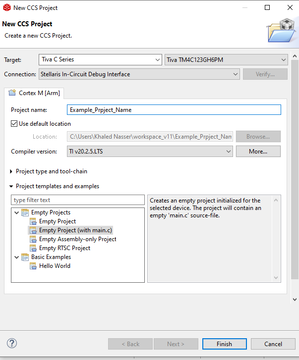

# Introduction-to-RTOS
This is an introduction i go through to learn about Real time operating system, It is only about basics and how to get hands on

# Project setup:
### 1-	Create Project in CCS
 - Set target to Tiva C series.
 - 	Choose Tiva M4C123GH6PM
 - 	Set connection to Stellaris In-Circuit Debug Interface
 - 	
### 2- Include FreeRtos files:
##### 2.1 FreeRTOS Files:
      - From source -> list.c, queue.c, tasks.c
      - From include -> copy all files except readme file
      - From Potable -> copy ARM_CM4F from CCS, copy heap_2.c from MemMang
##### 2.2 ARM Files:
This file specific to handle with arm like DIO, REGISTES, AND SPECIFIC FUNTIONS
I SEARCHED ONLINE AND DID NOT MAKE THEM.

      - DIO.c, DIO.h
      - PLL.c, PLL.h
      - Reg.h
      - Types.h
### 3- Configuration:
##### 3.1 Configuration file for FreeRTOS:
This file to Configure FreeRTOS, I get it from FreeRTOS website and set the option that I need

      -	FreeRTOSConfig.h
##### 4.1 Edit startup file:
We need to edit startup file in our project it’s a file which made automatically in each CCS project
-	Tm4c123gh6pm_startup_css.h  
We will include handlers in the file         
                      
          - extern void xPortPendSVHandler(void);
          - extern void vPortSVCHandler(void);
          - extern void xPortSysTickHandler(void);
          
# References:
- Special thanks to https://github.com/misaleh/FreeRtos-Labs as it was the main guide to complete this introduction
- https://freertos.org/
